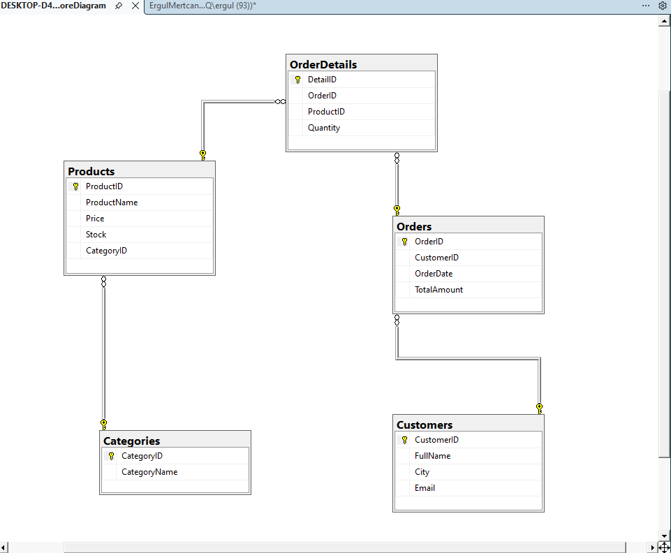

# NovaStore SQL Database

NovaStore, örnek bir e-ticaret iş alanı için SQL Server üzerinde tasarlanmış ilişkisel veritabanı projesidir. Proje; tablo ve ilişki oluşturma, örnek veri ekleme, JOIN ve toplama sorguları, view kullanımı ve veritabanı yedekleme adımlarını tek bir çalıştırılabilir T-SQL dosyasında sunar.

## Kullanılan Teknolojiler

- Microsoft SQL Server
- T-SQL
- SQL Server Management Studio (SSMS)
- İlişkisel veri modelleme

## Veri Modeli

| Tablo | Amaç | Temel İlişkiler |
| --- | --- | --- |
| `Categories` | Ürün kategorilerini tutar | `Products.CategoryID` tarafından referanslanır |
| `Products` | Ürün, fiyat ve stok bilgisini tutar | Bir kategoriye bağlıdır; sipariş detaylarında kullanılır |
| `Customers` | Müşteri bilgilerini tutar | Birden fazla sipariş verebilir |
| `Orders` | Sipariş başlık ve toplam tutar bilgisini tutar | Bir müşteriye bağlıdır |
| `OrderDetails` | Siparişlerdeki ürün ve miktar bilgisini tutar | Bir sipariş ile bir ürünü ilişkilendirir |

İlişkiler foreign key kısıtlarıyla tanımlanmıştır. `CategoryID`, `CustomerID`, `OrderID` ve `ProductID` alanları ilgili tablolar arasındaki veri bütünlüğünü sağlar.

## İlişkisel Şema



## Proje İçeriği

```text
NovaStore_Teslim/
├── ErgulMertcan_NovaStore_Proje.png
├── ErgulMertcan_NovaStore_Proje.sql
└── README.md
```

[`ErgulMertcan_NovaStore_Proje.sql`](ErgulMertcan_NovaStore_Proje.sql) aşağıdaki işlemleri sırasıyla gerçekleştirir:

1. `NovaStoreDB` veritabanını oluşturur.
2. Beş ilişkisel tabloyu ve foreign key bağlantılarını kurar.
3. Kategori, ürün, müşteri, sipariş ve sipariş detayı örnek verilerini ekler.
4. Doğrulama ve raporlama sorgularını çalıştırır.
5. `vw_SiparisOzet` view'ını oluşturur ve test eder.
6. Örnek bir tam veritabanı yedekleme komutu çalıştırır.

## Temel Sorgular

Projede şu T-SQL senaryoları bulunur:

- Stoğu belirli bir seviyenin altında kalan ürünleri listeleme
- Müşteri ve sipariş bilgilerini `INNER JOIN` ile birleştirme
- Seçilen müşterinin satın aldığı ürünleri çoklu tablo ilişkileriyle bulma
- Her kategorideki ürün sayısını `LEFT JOIN`, `COUNT` ve `GROUP BY` ile hesaplama
- Müşteri bazında toplam ciroyu `SUM` ile raporlama
- Sipariş tarihinden bugüne geçen süreyi `DATEDIFF` ile hesaplama

## View

`vw_SiparisOzet`, müşteri adı, sipariş tarihi, ürün adı ve miktar alanlarını tek bir sorgulanabilir görünümde birleştirir:

```sql
SELECT *
FROM vw_SiparisOzet;
```

## Çalıştırma

1. SQL Server'a SSMS veya uyumlu bir istemci ile bağlanın.
2. [`ErgulMertcan_NovaStore_Proje.sql`](ErgulMertcan_NovaStore_Proje.sql) dosyasını açın.
3. Komutları sırasıyla çalıştırmak için **Execute** seçeneğini kullanın.
4. Sonuç panellerindeki kayıt sayılarını ve sorgu çıktılarını kontrol edin.

> Script `NovaStoreDB` adında yeni bir veritabanı oluşturur. Aynı isimde bir veritabanı zaten varsa yeniden çalıştırmadan önce farklı bir ad kullanın veya mevcut ortamı bilinçli biçimde temizleyin.

## Yedekleme Notu

Dosyanın sonunda `BACKUP DATABASE` örneği bulunur. Varsayılan hedef `C:\\Yedek\\NovaStoreDB.bak` yoludur. Çalıştırmadan önce klasörün SQL Server servis hesabı tarafından erişilebilir olduğundan emin olun veya yolu kendi ortamınıza göre değiştirin.
